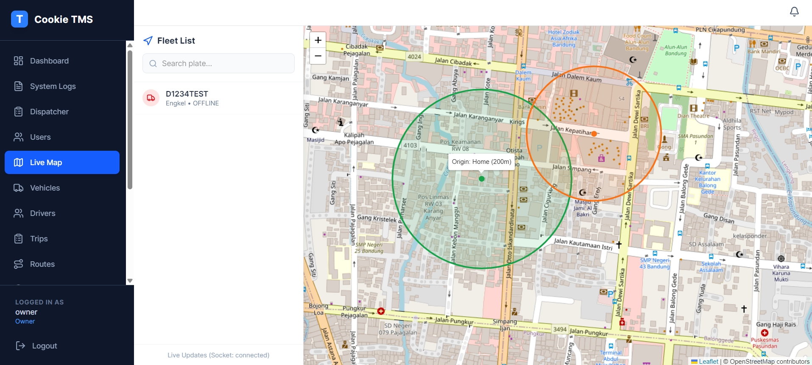

# 🍪 Cookie TMS
### Logistics that feels like a treat, not a chore.

[](LICENSE)
[]()
[]()

> **"Baking the smartest routes for your fleet. Zero crumbs left behind."**

---

## 📖 About
**Cookie TMS** is an open-source, self-hosted Transportation Management System designed for logistics companies who are tired of expensive, complicated software.

We combine **Real-time GPS Tracking** (powered by Traccar) with **Business Intelligence** (Invoicing, Route Optimization, and Driver Performance).

**Why "Cookie"?** Because like a browser cookie, this system remembers everything—every route, every stop, and every liter of fuel.

---

## ✨ Key Features (The "Treats")

### 🚚 For Business Owners
* **Smart Route Optimization:** Stop guessing. Our "Wizard Engine" calculates the fastest route to save fuel. (Coming soon)
* **Live Fleet Tracking:** Watch your trucks move in real-time on a beautiful map.
* **Geofence Auto-Arrival:** System automatically marks "ARRIVED" when a truck enters the warehouse. No more drivers lying about their location.(Coming soon)
* **Profit & Loss Dashboard:** Instantly see which truck is making money and which is losing money.

### 🛠 For Developers
* **Modern Stack:** Built with **Django (Python)** backend and **React** frontend.
* **Secure:** JWT Authentication & Role-Based Access Control (RBAC).
* **Scalable:** Dockerized architecture ready for production.
* **Open Architecture:** Easy API integration with your existing ERP or WMS.

---

## Screenshot



---

## 🚀 Getting Started
Get your instance running in less than 5 minutes.

### Prerequisites
* Docker & Docker Compose
* A hunger for efficiency 🍪

### Installation
```bash
# 1. Clone the repo
git clone [https://github.com/caffeine-dev-rafly/cookie-tms.git](https://github.com/caffeine-dev-rafly/cookie-tms.git)
cd cookie-tms

# 2. Set up environment
cp .env.example .env

# 3. Bake the code (Run Docker)
docker-compose up -d --build

# 4. Seed demo data (Optional - for testing)
docker-compose exec web python manage.py loaddata demo_seedocker-compose exec web python manage.py loaddata demo_seedocker-compose exec web python manage.py loaddata demo_seed


